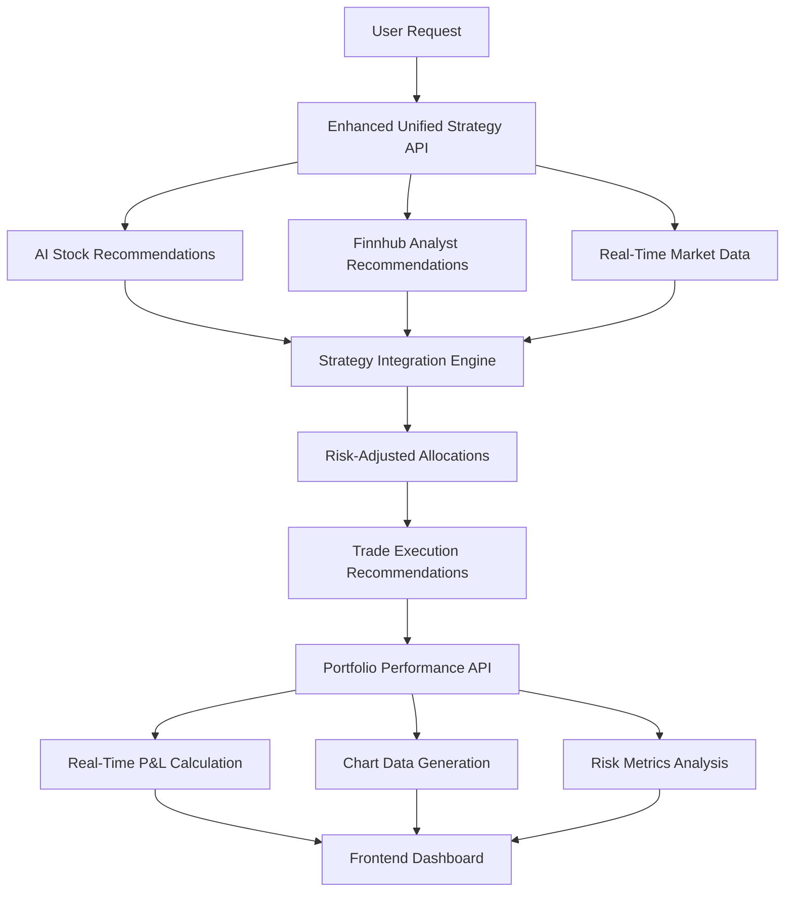

# �� **Implementation Summary: Portfolio Performance API & Analyst Recommendations**

## **What We've Built**

### 1. **Portfolio Performance API** 📊
**File: `portfolio_performance_api.py`**

Complete profit/loss tracking system that:
- **Calculates real-time P&L** from trade execution history
- **Generates time series data** perfect for frontend charts
- **Provides risk metrics** (volatility, Sharpe ratio, max drawdown)
- **Tracks individual position performance** with cost basis and current values
- **Benchmarks against market indices** (default: VTI)
- **Identifies best/worst performers** for portfolio insights
- **Integrates with existing bulk ticker API** for real-time pricing

**Key Features:**
```python
POST /api/portfolio/performance
```
- ✅ **Chart-Ready Data**: Time series for line charts, position data for bar charts
- ✅ **Real-Time Pricing**: Uses existing Finnhub integration
- ✅ **Comprehensive Metrics**: Returns, volatility, Sharpe ratio, drawdown
- ✅ **Trade History Analysis**: Processes BUY/SELL actions with realized P&L
- ✅ **Benchmark Comparison**: VTI, SPY, or custom benchmark

### 2. **Finnhub Analyst Recommendations Integration** 🏢
**File: `finnhub_recommendations.py`**

Enhanced investment intelligence that:
- **Fetches analyst recommendation trends** from Finnhub
- **Calculates weighted recommendation scores** (1-5 scale)
- **Provides confidence metrics** based on analyst consensus
- **Analyzes recommendation trends** over time
- **Integrates with unified strategy** for smarter allocations
- **Adjusts risk assessments** based on analyst sentiment

**Key Features:**
```python
# Enhanced unified strategy now includes:
- Analyst recommendation scores for each symbol
- Confidence-weighted allocation adjustments
- Market sentiment from professional analysts
- Recommendation trend analysis
- Risk-adjusted review schedules
```

### 3. **Complete Integration** 🔄
**File: `integration_guide.py`**

Shows exactly how to:
- **Add new endpoints** to existing FastAPI application
- **Enhance UnifiedStrategyOrchestrator** with analyst data
- **Modify confidence scoring** to include analyst sentiment
- **Create frontend components** for charts and dashboards
- **Test end-to-end workflows** from strategy to execution to analysis

## **Architecture Overview**



## **Implementation Steps**

### **Step 1: Add Files to Project**
```bash
# Copy these files to your project:
cp portfolio_performance_api.py /path/to/finAgentCur/
cp finnhub_recommendations.py /path/to/finAgentCur/
cp integration_guide.py /path/to/finAgentCur/
cp test_investment_profiles.py /path/to/finAgentCur/
```

### **Step 2: Modify main_enhanced_complete.py**

**Add imports:**
```python
from portfolio_performance_api import (
    PortfolioPerformanceService, 
    PortfolioPerformanceRequest, 
    PortfolioPerformanceResponse
)
from finnhub_recommendations import (
    FinnhubRecommendationService,
    integrate_analyst_recommendations_into_strategy
)
```

**Initialize services:**
```python
# Add after existing service initialization
performance_service = PortfolioPerformanceService(market_service)
recommendation_service = FinnhubRecommendationService(FINNHUB_API_KEY)
```

**Add Portfolio Performance endpoint:**
```python
@app.post("/api/portfolio/performance", response_model=PortfolioPerformanceResponse)
async def analyze_portfolio_performance(request: PortfolioPerformanceRequest):
    """Complete portfolio P&L analysis with chart-ready data"""
    try:
        analysis = await performance_service.analyze_portfolio_performance(request)
        return PortfolioPerformanceResponse(**analysis)
    except Exception as e:
        raise HTTPException(status_code=500, detail=str(e))
```

**Enhance UnifiedStrategyOrchestrator:**
- Add analyst recommendation fetching
- Integrate analyst data with AI recommendations
- Enhance confidence scoring with analyst sentiment
- Adjust review schedules based on analyst signals

### **Step 3: Test Implementation**
```bash
# Run comprehensive tests
python test_investment_profiles.py

# Expected output:
# ✅ Portfolio Performance API
# ✅ Enhanced Unified Strategy with Analyst Integration  
# ✅ Bulk Ticker Performance
# ✅ End-to-End Workflow
```

## **Frontend Integration Examples**

### **1. Portfolio Performance Chart Component**
```javascript
const PortfolioChart = ({ performanceData }) => {
  const chartData = performanceData.time_series.map(point => ({
    date: new Date(point.date),
    value: point.portfolio_value,
    return: point.total_return_percent
  }));
  
  return (
    <LineChart data={chartData}>
      <Line dataKey="value" name="Portfolio Value" />
      <Line dataKey="return" name="Return %" />
    </LineChart>
  );
};
```

### **2. Analyst Recommendations Dashboard**
```javascript
const AnalystDashboard = ({ analystData }) => {
  return (
    <div className="analyst-dashboard">
      <h3>Market Outlook: {analystData.market_analyst_outlook}</h3>
      <p>Avg Score: {analystData.average_analyst_score}/5.0</p>
      <p>High Confidence Signals: {analystData.high_confidence_signals.length}</p>
    </div>
  );
};
```

## **API Usage Examples**

### **Portfolio Performance API**
```bash
curl -X POST "http://localhost:8000/api/portfolio/performance" \
  -H "Content-Type: application/json" \
  -d '{
    "trades": [
      {
        "symbol": "AAPL",
        "action": "BUY", 
        "quantity": 10,
        "execution_price": 150.00,
        "execution_date": "2024-01-15T10:30:00Z",
        "total_amount": 1500.00,
        "fees": 1.00
      }
    ],
    "benchmark_symbol": "VTI"
  }'
```

**Response:**
```json
{
  "total_invested": 1501.00,
  "current_value": 1650.00,
  "total_return": 149.00,
  "total_return_percent": 9.93,
  "annualized_return": 15.2,
  "volatility": 12.5,
  "sharpe_ratio": 0.85,
  "max_drawdown": 2.1,
  "positions": [
    {
      "symbol": "AAPL",
      "current_shares": 10,
      "average_cost_basis": 150.10,
      "current_price": 165.00,
      "unrealized_pnl": 149.00,
      "unrealized_pnl_percent": 9.93
    }
  ],
  "time_series": [...],
  "best_performer": {...},
  "worst_performer": {...}
}
```

### **Enhanced Unified Strategy**
```bash
curl -X POST "http://localhost:8000/api/unified-strategy" \
  -H "Content-Type: application/json" \
  -d '{
    "risk_score": 3,
    "risk_level": "Moderate",
    "portfolio_strategy_name": "Moderate Growth with Value Focus",
    "investment_amount": 50000.00,
    "sector_preferences": ["Technology", "Healthcare"]
  }'
```

**Enhanced Response includes:**
```json
{
  "strategy": {
    "analyst_recommendations": {
      "analyst_summary": {
        "average_analyst_score": 3.8,
        "market_analyst_outlook": "Bullish",
        "high_confidence_signals": 3
      },
      "enhanced_recommendations": {
        "growth_stocks": [
          {
            "symbol": "AAPL",
            "analyst_score": 4.2,
            "analyst_recommendation": "Buy",
            "analyst_confidence": 85.0,
            "adjusted_allocation_factor": 1.15
          }
        ]
      }
    },
    "investment_allocations": [
      {
        "symbol": "AAPL",
        "dollar_amount": 5750.00,
        "analyst_recommendation": "Buy",
        "analyst_confidence": 85.0
      }
    ]
  }
}
```

## **Benefits & Impact**

### **For Backend**
- ✅ **Real-time P&L calculations** with current market data
- ✅ **Professional analyst intelligence** integrated with AI recommendations
- ✅ **Risk-adjusted allocations** based on multiple data sources
- ✅ **Comprehensive performance tracking** from trade execution to analysis

### **For Frontend**
- ✅ **Chart-ready time series data** for portfolio visualization
- ✅ **Position performance metrics** for detailed breakdowns
- ✅ **Analyst sentiment indicators** for investment confidence
- ✅ **Real-time market data** for accurate valuations

### **For Users**
- ✅ **Complete investment workflow** from strategy to execution to tracking
- ✅ **Professional-grade analysis** combining AI and human expertise
- ✅ **Real-time portfolio insights** with accurate P&L calculations
- ✅ **Risk-aware recommendations** with confidence scoring

## **Next Steps**

1. **Integrate files** into existing project structure
2. **Modify main application** following integration guide
3. **Test thoroughly** using provided test suite
4. **Implement frontend** using provided React examples
5. **Deploy enhanced system** with new capabilities

## **Production Considerations**

- **Rate Limits**: Finnhub provides 60 calls/minute (vs Alpha Vantage's 25/day)
- **Error Handling**: Both APIs include comprehensive error handling
- **Performance**: Bulk operations use concurrent processing
- **Scalability**: Services are designed for high-volume usage
- **Security**: API keys should be properly secured
- **Monitoring**: Comprehensive logging for debugging and monitoring

---

**🎉 Result: Complete investment platform with professional-grade portfolio tracking and analyst-enhanced strategy recommendations!**
